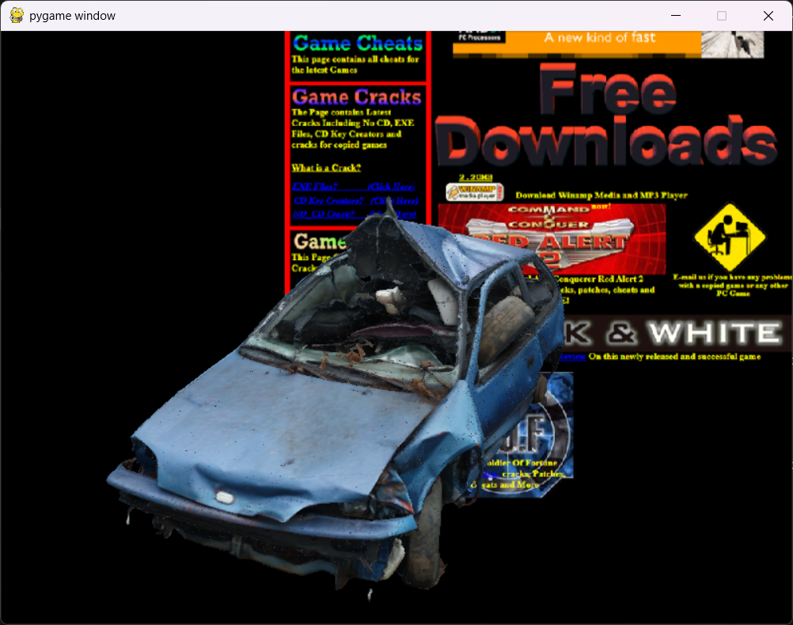
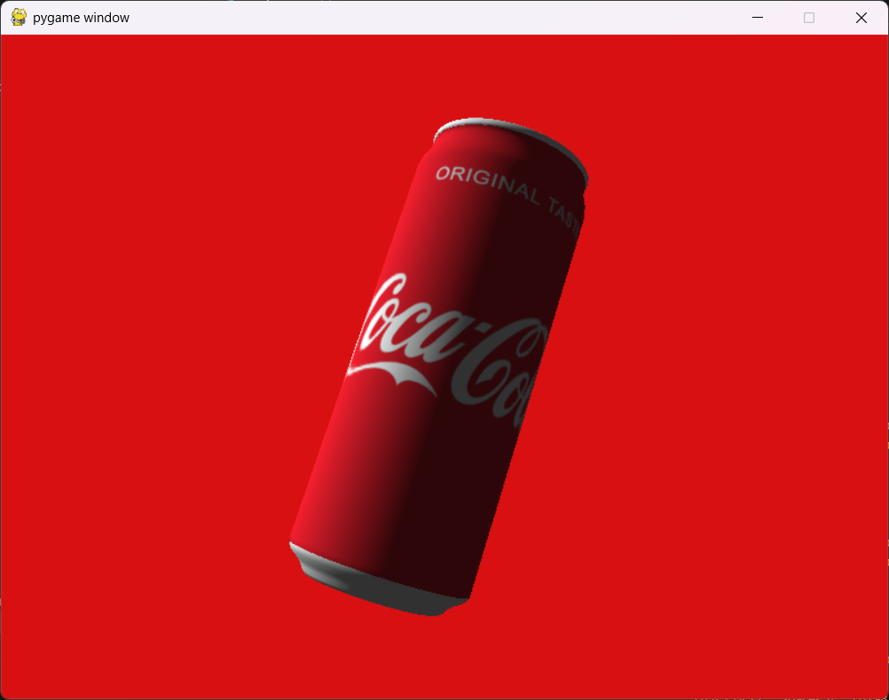

# shiba
 light glTF viewer
---

Shiba is built with Python, OpenGL, and Pygame. It loads glTF models, automatically centers and scales them, and renders them with simple directional lighting.

**Controls:**
- **Arrow Keys:** Adjust the lighting direction.
- **T Key:** Toggle lighting on/off.
- **Mouse Wheel:** Zoom in and out.

